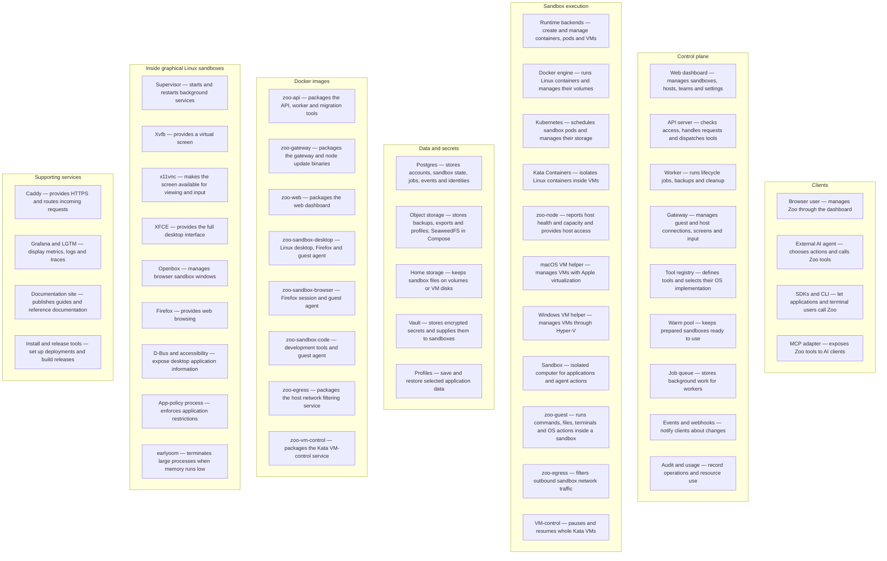

# Zoo components

```mermaid
flowchart TB
    subgraph clients ["Clients"]
        person["Browser user — manages Zoo through the dashboard"]
        agent["External AI agent — chooses actions and calls Zoo tools"]
        sdk["SDKs and CLI — let applications and terminal users call Zoo"]
        mcp["MCP adapter — exposes Zoo tools to AI clients"]
    end

    subgraph controlPlane ["Control plane"]
        web["Web dashboard — manages sandboxes, hosts, teams and settings"]
        api["API server — checks access, handles requests and dispatches tools"]
        worker["Worker — runs lifecycle jobs, backups and cleanup"]
        gateway["Gateway — manages guest and host connections, screens and input"]
        registry["Tool registry — defines tools and selects their OS implementation"]
        pool["Warm pool — keeps prepared sandboxes ready to use"]
        queue["Job queue — stores background work for workers"]
        events["Events and webhooks — notify clients about changes"]
        audit["Audit and usage — record operations and resource use"]
    end

    subgraph execution ["Sandbox execution"]
        runtime["Runtime backends — create and manage containers, pods and VMs"]
        docker["Docker engine — runs Linux containers and manages their volumes"]
        kube["Kubernetes — schedules sandbox pods and manages their storage"]
        kata["Kata Containers — isolates Linux containers inside VMs"]
        node["zoo-node — reports host health and capacity and provides host access"]
        mac["macOS VM helper — manages VMs with Apple virtualization"]
        win["Windows VM helper — manages VMs through Hyper-V"]
        sandbox["Sandbox — isolated computer for applications and agent actions"]
        guest["zoo-guest — runs commands, files, terminals and OS actions inside a sandbox"]
        egress["zoo-egress — filters outbound sandbox network traffic"]
        vmControl["VM-control — pauses and resumes whole Kata VMs"]
    end

    subgraph data ["Data and secrets"]
        db["Postgres — stores accounts, sandbox state, jobs, events and identities"]
        objects["Object storage — stores backups, exports and profiles; SeaweedFS in Compose"]
        homes["Home storage — keeps sandbox files on volumes or VM disks"]
        vault["Vault — stores encrypted secrets and supplies them to sandboxes"]
        profiles["Profiles — save and restore selected application data"]
    end

    subgraph images ["Docker images"]
        apiImage["zoo-api — packages the API, worker and migration tools"]
        gatewayImage["zoo-gateway — packages the gateway and node update binaries"]
        webImage["zoo-web — packages the web dashboard"]
        desktopImage["zoo-sandbox-desktop — Linux desktop, Firefox and guest agent"]
        browserImage["zoo-sandbox-browser — Firefox session and guest agent"]
        codeImage["zoo-sandbox-code — development tools and guest agent"]
        egressImage["zoo-egress — packages the host network filtering service"]
        vmImage["zoo-vm-control — packages the Kata VM-control service"]
    end

    subgraph desktop ["Inside graphical Linux sandboxes"]
        supervisor["Supervisor — starts and restarts background services"]
        xvfb["Xvfb — provides a virtual screen"]
        vnc["x11vnc — makes the screen available for viewing and input"]
        xfce["XFCE — provides the full desktop interface"]
        openbox["Openbox — manages browser sandbox windows"]
        firefox["Firefox — provides web browsing"]
        bus["D-Bus and accessibility — expose desktop application information"]
        apps["App-policy process — enforces application restrictions"]
        oom["earlyoom — terminates large processes when memory runs low"]
    end

    subgraph supporting ["Supporting services"]
        caddy["Caddy — provides HTTPS and routes incoming requests"]
        telemetry["Grafana and LGTM — display metrics, logs and traces"]
        site["Documentation site — publishes guides and reference documentation"]
        installers["Install and release tools — set up deployments and build releases"]
    end
```
